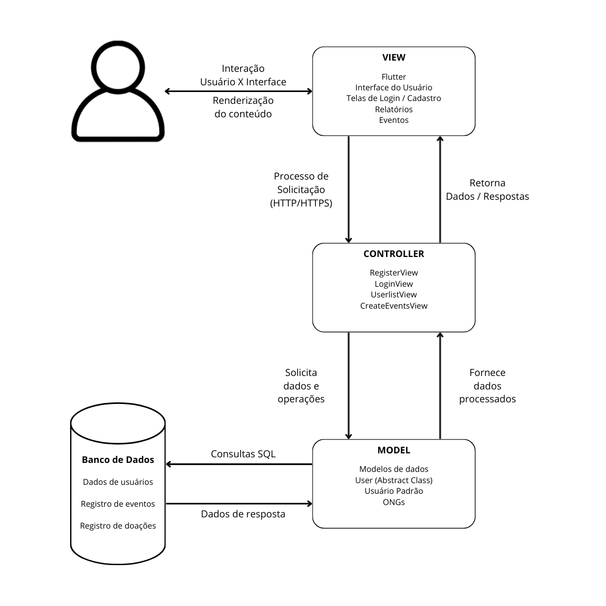
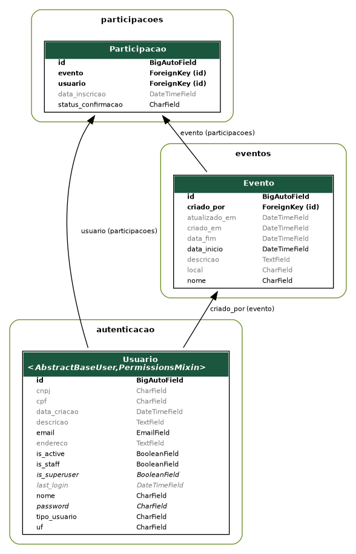
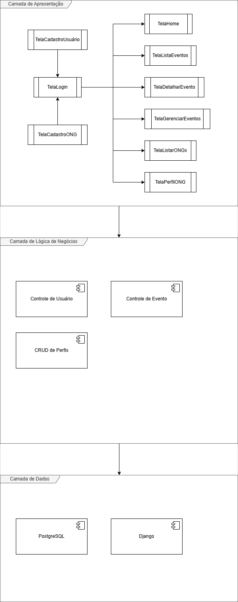
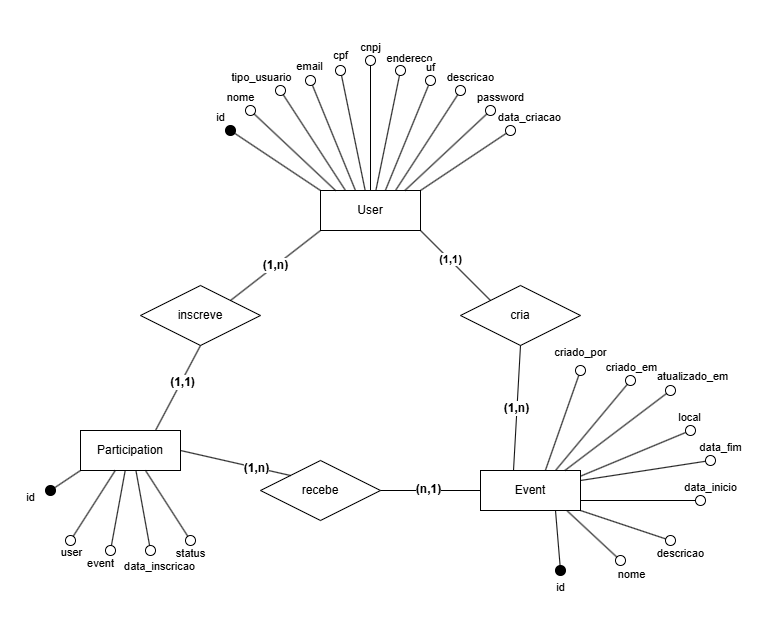

# Documento de Arquitetura 

## Visão Geral

|  |  |
| :--- | :--- |
| **Projeto** | Apoia+  |
| **Disciplina** | Métodos de Desenvolvimento de Software (MDS)  |
| **Versão** | 2.0  |

## Histórico de Revisão 

| Data | Versão | Descrição | Autor(es) |
| :--- | :--- | :--- | :--- |
| 30/10 | 1.0 | Tópico 1.1 | Ester |
| 30/10 | 1.0 | Tópico 1.2 | Artur  |
| 30/10 | 1.0 | Tópicos 2.1, 2.2, 2.8 | Edson  |
| 30/10 | 1.0 | Tópico 2.3 | Lucas  |
| 30/10 | 1.0 | Tópico 2.4 | Guilherme Carvalho  |
| 31/10 | 1.0 | Tópico 2.6 | Edson e Lucas  |
| 31/10 | 1.0 | Tópico 2.7 | Guilherme Carvalho  |
| 31/10 | 1.0 | Tópico 2.8 | Artur e Ester  |
| 31/10 | 1.0 | Revisão ABNT | Maria Luana  |
| 28/11 | 1.1 | Tópicos 1.2, 2.6, 2.7 | Guilherme Carvalho  |
| 06/12 | 1.2 | Tópicos 2.3, 2.6 | Lucas  |
| 12/12 | 2.0 | Tópicos 1.6, 2.3, 2.5 | Edson |

## Autores 

| Matrícula | Nome | Descrição do papel assumido na equipe | % de contribuição ao trabalho (*) |
| :--- | :--- | :--- | :--- |
| 232024527 | Artur | |  |
| 232025730 | Edson | |  |
| 241012211 | Ester | |  |
| 241011822 | Guilherme C | |  |
| 222006777 | Guilherme | |  |
| 231026456 | Lucas | |  |
| 231012002 | Luis Fernando | |  |
| 241011448 | Maria Luana | |  |
| 190129344 | Paulo Vinicius | |  |
| 241011878 | Thauany | |  |
| 241012392 | Vinicius | |  |

## 1. Introdução 

### 1.1 Propósito 

Este documento descreve a visão arquitetural abrangente do **Apoia+**, desenvolvido como parte de um projeto acadêmico da disciplina de Métodos de Desenvolvimento de Software (MDS), no segundo semestre de 2025. O propósito é registrar as decisões arquiteturais tomadas durante o planejamento e implementação do sistema, servindo como um guia para desenvolvedores e testadores.

Ele descreve as escolhas tecnológicas, os padrões de design e a decomposição de componentes adotados para atender aos requisitos específicos de conexão entre voluntários e ONGs no DF, facilitando a organização e participação em eventos para um desenvolvimento coeso e um produto escalável.

### 1.2 Escopo

O presente documento descreve a arquitetura do sistema **“Apoia+”**, uma aplicação móvel desenvolvida com o objetivo de conectar pessoas dispostas a doar para instituições sociais e ONGs cadastradas, promovendo o engajamento solidário e facilitando o acesso a campanhas de apoio em diferentes regiões. O sistema busca centralizar informações sobre campanhas ativas, simplificar o processo de doação e fortalecer a visibilidade das organizações sociais, alinhando-se a objetivos de desenvolvimento sustentável, como redução das desigualdades e erradicação da pobreza.

O escopo do projeto abrange o desenvolvimento de uma aplicação leve, acessível, responsiva e intuitiva, compatível tanto com dispositivos móveis quanto navegadores web, e que permita:

* O cadastro e autenticação de usuários (doadores e representantes de ONGs);
* O cadastro e a gestão de ONGs e campanhas de arrecadação;
* A busca e visualização de pontos de apoio e campanhas próximas;
* centralizar informações de como doar e outras maneiras de ajudar;
* A criação e divulgação de eventos por parte das ONGs cadastradas, com a possibilidade de usuários visualizarem e escolherem participar ou não;

Dessa forma, o **Apoia+** visa criar um ambiente digital de impacto social positivo, promovendo a solidariedade e tornando o processo de doação mais simples, transparente e acessível a todos.

## 2. Representação Arquitetural 

### 2.1 Definições

O sistema seguirá uma arquitetura em camadas, com o modelo arquitetural escolhido **MVC (Model–View–Controller)** com o Framework **Django**.

### 2.2 Justificativa 

A escolha da arquitetura em MVC é uma consequência direta da adoção dos frameworks **Django** e **Flutter**, que foram selecionados com base nas necessidades do projeto e no plano de capacitação da equipe.  

A arquitetura MVC possui como princípios a organização e a reutilização de código, a abordagem MVC do Django é adequada aos requisitos de nosso produto. Será principalmente por meio do Django que a lógica de negócios (Controller) e a estrutura de dados (Model) serão implementadas, o que é ideal para construir a API RESTful que o sistema necessita.

Concluímos que esta arquitetura de backend se integra bem ao cliente desenvolvido em Flutter, que consumirá os endpoints (rotas da API) gerados pelo Django. 

Dessa forma, acreditamos que essa escolha será vantajosa não apenas em termos de organização, mas também por facilitar o desenvolvimento, a manutenção, os testes e as possíveis modificações futuras no projeto. 

### 2.3 Detalhamento 

#### 2.3.1 Arquitetura Geral do Sistema Apoia+

A arquitetura do sistema **Apoia+** segue o padrão **MVC (Model–View–Controller)**, distribuído entre duas camadas principais:

* Backend, desenvolvido em **Django**, responsável por toda lógica de negócios, regras de autenticação, processamento de dados e comunicação com o banco de dados.

* Frontend, desenvolvido em **Flutter**, responsável pela interação direta com o usuário.

O diagrama representa o fluxo completo entre essas camadas, descrevendo como os componentes do sistema se organizam e interagem.

#### 2.3.2 View (Flutter) – Interface e Interação com o Usuário

No topo da arquitetura está a **View**, representada pela aplicação **Flutter**. É neste nível que ocorre toda a interação do usuário com a interface, incluindo:

* Telas de login e cadastro
* Listagem de usuários
* Tela de criação de eventos
* Tela de edição de perfil
* Tela de perfil informativo para ongs
* Visualização de dados gerais do sistema

A **View** tem como função consumir os endpoints fornecidos pelo **Django** e renderizar no aplicativo as informações retornadas pela API.

#### 2.3.3 Controller (Django Views) – Lógica de Negócio e Rotas da API

O **Controller**, implementado no **Django** através de suas **Views** (RegisterView, LoginView, UserListView, CreateEventsView, entre outras), recebe as requisições feitas pelo **Flutter** e atua como intermediário entre o frontend e o backend. Suas principais responsabilidades incluem:

* Interpretar e validar requisições do cliente
* Coordenar operações de leitura e escrita no banco de dados
* Aplicar regras de negócio
* Formatar e retornar respostas apropriadas para o **Flutter**

Ou seja, toda a lógica que determina como as operações devem ocorrer fica concentrada no **Controller**, que decide o que solicitar ao **Model** e o que retornar à **View**.

#### 2.3.4 Model (Django Models) – Representação e Manipulação dos Dados

O **Model** corresponde à camada de dados do **Django**, responsável por representar e manipular as entidades centrais do sistema. Entre os modelos utilizados estão:

* User (classe abstrata) — base para os diferentes tipos de usuários
* Usuário Padrão — usuários comuns do sistema
* ONGs — entidades cadastradas
* Eventos — atividades criadas pelas ONGs

Essa camada possui a função de fornecer dados processados ao **Controller**, além de executar operações como consultas, inserções, atualizações ou remoções no banco de dados.

#### 2.3.5 Banco de Dados – Armazenamento com PostgreSQL

O sistema **Apoia+** utiliza o **PostgreSQL** como banco de dados relacional para armazenamento de informações da aplicação. O **PostgreSQL** foi escolhido por sua robustez, conformidade com o padrão SQL, escalabilidade e suporte nativo a transações complexas, tornando-o ideal para aplicações que exigem integridade e consistência. No banco de dados estão armazenados:

* Informações de usuários, incluindo dados de autenticação e perfis
* Registros de ONGs e seus dados administrativos
* Eventos criados pelas ONGs

Após o processamento, o banco retorna os dados necessários, permitindo que os **Models** os repassem ao **Controller** de maneira segura e estruturada.

***

<em>Figura 1 - Representação da Arquitetura</em>

<em>Fonte: <a href="https://github.com/LucasItacaramby">Lucas Itacaramby</a></em>

***

### 2.4 Metas e Restrições Arquiteturais 

* **Padrões de codificação:** O código deve seguir as melhores práticas de codificação para Python/Django (PEP 8).
* **Manutenibilidade:** O sistema deve ser modular e possuir baixo acoplamento entre os componentes em visão de um projeto mais fácil de se manter e realizar alterações.
* **Segurança:** As APIs desenvolvidas no backend Django devem seguir as melhores práticas possíveis e passar em testes como aqueles definidos pelo OWASP
* **Versionamento:** O padrão usado para realizar mudanças no código e utilizar a ferramenta Git eficientemente será o **Git Flow**.

Todos os elementos mencionados contribuem para um desenvolvimento de software mais ágil e eficiente, no qual os membros da equipe permanecem alinhados na codificação e nas metas estabelecidas. Em última instância, esses objetivos e restrições visam garantir um produto confiável e proporcionar uma experiência satisfatória ao usuário.

### 2.5 Backlog do Produto (Escopo do Produto) 

No escopo do projeto ‘Apoia+’, a equipe decidiu por uma aplicação mobile para Android com intuito de suprir a necessidade de voluntários e de Organizações Não Governamentais (ONGs) em causas humanitárias, mais especificamente em causas envolvendo indivíduos em situação de rua.

Assim, o produto de software tem como funcionalidades:

* Sistema de cadastro e login;
* Perfil público com informações pertinentes para voluntários e ONGs;
* CRUD (Create, Read, Update e Delete) de eventos para ONGs;
* Divulgação de eventos;
* Possibilidade de se inscrever antecipadamente em eventos;
* Geração de uma lista com participantes com presença confirmada no evento;

Essas funcionalidades surgem para permitir uma maior integração entres voluntários e ONGs, assim centralizando distribuição de informações em apenas um canal de comunicação. A partir disso, a escolha arquitetural do produto surge em razão da experiencia prévia da equipe, assim escolhendo modelo **MVC (Model–View–Controller)**, portanto essa escolha juntamente com a decisão de adotar o *framework* **Django**, estabeleceu o padrão final sendo o **MVC (Model–View–Controller)** para o framework escolhido.

### 2.6 Visão Lógica 

O sistema Apoia+ é organizado em uma arquitetura **Cliente-Servidor em camadas**. A camada de Servidor (**Backend**) segue o padrão **MVC** (Model–View–Controller) com **Django** , e a camada de Cliente (**Frontend**) é um aplicativo móvel (**Flutter**) que consome os dados do servidor.

#### 2.6.1 Módulos do Sistema (Backend - Django) 

| **Módulo (App)**                  | **Razão Lógica**                                                   | **Componentes Principais**                                                  |
| :-------------------------------- | :----------------------------------------------------------------- | :-------------------------------------------------------------------------- |
| **Autenticação** (`autenticacao`) | Gerenciar cadastro, login e segurança                              | **Model:** Usuário. **View:** CadastroView, LoginView, LogoutView.       |
| **Eventos** (`eventos`)           |  Permite o CRUD de eventos                                         | **Model:** Eventos (tipo_usuario: ong). **View:** ONGView.               |
| **Participação** (`participacoes`)| Permite gerenciar a inscrição de voluntários nos eventos           | **Model:**Participação. **View:** EventoView, ParticipacaoView.          |
| **Administração**                 | Gerencia usuários e configurações do sistema                       | Utiliza o módulo `django.contrib.admin`.                                    |

#### 2.6.2 Módulos do Sistema (Frontend - Flutter) 

| Módulo (App) | Telas | Serviços |
| :--- | :--- | :--- |
| **Autenticação**  | TelaLogin, TelaCadastroUsuario, TelaCadastroONG  | **AuthService** (chama HTTP para LoginView e RegisterView). |
| **ONGs e Eventos**  | Home, TelaListarEventos, TelaListarONGs, TelaDetalharEvento, TelaPerfilONG, TelaGerenciarEventos  | **EventoService** (Chama /eventos), **ONGService** (Chama /ongs). |

#### 2.6.3 Comunicação entre Módulos (Interfaces) 

* **APIs REST:** O Backend (Django) expõe endpoints RESTful (ex: `/api/v1/eventos`) que o Frontend (Flutter) consome via requisição HTTPS.
* **Banco de Dados:** PostgreSQL é acessado **apenas** pelo Backend (Django). O Frontend (Flutter) nunca se comunica diretamente com o banco de dados.

#### 2.6.4 Diagrama de Classes 

O diagrama de classes apresentado a seguir ilustra a estrutura básica do sistema **Apoia+**, mostrando os principais componentes e como eles se relacionam entre si. Essa representação permite visualizar os elementos fundamentais que compõem a aplicação, incluindo as entidades principais, suas características e as conexões existentes.

***

<em>Figura 2 - Diagrama de classes</em>

<em>Fonte: <a href="https://github.com/edso-n">Edson Pereira</a></em>

***

As entidades centrais são **Usuário**, **ONG**, **Evento** e **Participação**.

* A classe **Usuário** é a base para qualquer pessoa no sistema.
* Existe uma relação **um-para-um (1:1)** entre **Usuário** e **ONG**, onde o Usuário responsável é vinculado à ONG através do atributo `id_responsavel`.
* Um usuário do tipo ONG pode cadastrar múltiplos **Eventos** (**1:N**).
* A relação **muitos-para-muitos (N:M)** entre **Usuários** e **Eventos** é resolvida através da classe associativa **Participacao**.
* A classe **Participacao** conecta Usuário e Evento (usando `id_usuario`, `id_evento`) e armazena atributos da inscrição, como `status_confirmacao`.

#### 2.6.5 Diagrama de Pacotes

O diagrama de pacotes apresentado representa a organização estrutural do projeto **Apoia+**, que adota um modelo de desenvolvimento baseado em monorepo. Esse formato permite que tanto o backend quanto o frontend coexistam em um mesmo repositório, mantendo uma separação clara entre responsabilidades, mas facilitando integração, versionamento e manutenção. Cada parte do sistema é organizada em workspaces independentes, compondo os módulos principais do projeto.

***

<em>Figura 3 - Diagrama de pacotes</em>

<em>Fonte: <a href="https://github.com/LucasItacaramby">Lucas Itacaramby</a></em>

***

### Estrutura Geral do Monorepo

Seguindo a estrutura de Cliente-Servidor em construção de software MonoRepo, temos a seguinte visão lógida do software:

> Estrutura Macro

Na camada superior do diagrama está o pacote **Apoia+** Monorepo (*Workspaces*). Ele funciona como o ambiente de trabalho unificado que abriga os dois subsistemas principais do projeto:

* Apoia+ (Backend) — responsável pela lógica de servidor, autenticação, gestão de dados e execução das regras de negócio
* mobile_apoia (Frontend) — responsável pela interface do usuário e pela lógica de interação no aplicativo mobile construído em **Flutter**

Essa estrutura deixa explícito que ambos os módulos coexistem no mesmo repositório, mas mantêm autonomia funcional.

> Módulos Principais

As pastas `Apoia+/` e `mobile_apoia/` possuem os componentes principais do sistema:

### Pacote Apoia+ (Backend)

O pacote **Apoia+** (Backend) representa a implementação da API e de toda a lógica de backend utilizando o framework **Django**. Ele agrupa dois elementos centrais da aplicação:

#### **> Models (autenticação, eventos, participações)**

Este pacote concentra os modelos de domínio responsáveis por representar e manipular as principais entidades do sistema, como:

* `Apoia+/autenticacao`
* `Apoia+/eventos`
* `Apoia+/participacoes`

Ele encapsula as regras de consistência e a estrutura dos dados que serão persistidos no banco.

Os **testes de API** são configurados com o **pytest** e estão na pasta `Apoia+/tests`, com foco em testes de integração e testes unitários.

#### **> Database (PostgreSQL)**

Representa o banco de dados utilizado pelo backend, implementado em **PostgreSQL** e rodando a partir de um container do **Docker**.
O backend interage com o **PostgreSQL** garantindo abstração e controle sobre operações como consultas, inserções e atualizações.

O diagrama reforça que o backend é responsável por expor endpoints HTTP/S, que serão consumidos pelo frontend.

### Pacote mobile_apoia (Frontend)

O pacote mobile_apoia (Frontend) representa o aplicativo mobile desenvolvido em **Flutter**. Esse módulo reúne todos os componentes relacionados à interface e lógica de cliente. Seus subpacotes são:

#### **> Telas (Flutter)**

Contém as páginas visuais do aplicativo, incluindo:

* Tela de login
* Tela de cadastro
* Visualização de eventos
* Listagens
* Detalhes de ONGs e ações

São elementos totalmente focados na interação com o usuário.

#### **> Componentes (UI)**

Reúne elementos reutilizáveis que compõem a interface gráfica, como:

* Botões
* Cards
* Form inputs
* Layouts comuns

Este pacote garante maior organização, modularidade e reaproveitamento no frontend.

### Comunicação entre Backend e Frontend

O diagrama destaca a relação entre os dois pacotes principais:
O mobile_apoia (Frontend) consome os serviços publicados pelo Apoia+ (Backend) através de requisições HTTP/S.

### 2.7 Visão de Dados (MER) 

O modelo entidade-relacionamento representa a estrutura lógica dos dados do software **Apoia+**, descrevendo as entidades do sistema, além de descrever a cardinalidade entre as entidades.

***

<em>Figura 4 - Modelo Entidade-Relacionamento</em>

<em>Fonte: <a href="https://github.com/LucasItacaramby">Lucas Itacaramby</a></em>

***

#### Tabela 1: Entidades do Sistema 
| Entidades | Descrição |
| :--- | :--- |
| **Usuário** | Representa os usuários cadastrados no sistema, podendo ser ONGs ou Voluntários, armazenando dados essenciais  |
| **Evento** | Armazena as informações sobre os eventos criados, como nome, descrição, data, local, vagas e número de participantes  |
| **Participação** | Representa o vínculo entre um usuário e um evento, atuando como intermediário  |

#### Tabela 2: Relação e Cardinalidade entre Entidades

| Entidade A | Relação | Entidade B | Cardinalidade |
| :--- | :--- | :--- | :--- |
| Usuário | Cria | Evento | 1:N (uma ONG cria/edita vários eventos) |
| Usuário | Participa | Evento | N:N (um voluntário participa de vários eventos, um evento tem vários voluntários) |
| Participação | Associa | Usuário e Evento | Resolve a relação N:N (intermediário) |

A partir da definição do papel assumido pelas entidades descritas, associamos estas às respectivas tabelas, de forma que cada linha (registro) da tabela representa uma instância da entidade, e cada coluna representa um atributo dessas entidades. Além disso, surge a necessidade de especificar os atributos de cada tabela para auxiliar o desenvolvimento. 

#### Tabela 3: Tabelas do Sistema
| Entidades | Descrição |
| :--- | :--- |
| **Usuário** | Implementação da entidade Usuário e seus atributos no banco de dados  |
| **Evento** | Implementação da entidade Evento e seus atributos no banco de dados  |
| **Participação** | Implementação da entidade Participação e seus atributos no banco de dados   |

##### Tabela 4 : Atributos de usuário

| Atributos | Tipo de Dados | Chave | Descrição |
| :--- | :--- | :--- | :--- |
| `id_usuario` | INT | PK | Identificador único do usuário  |
| `nome` | VARCHAR(50) | | Nome do usuário  |
| `email` | VARCHAR(50) | | E-mail utilizado para login  |
| `senha` | VARCHAR(50) | | Senha cripstografada do usuário  |
| `localizacao` | VARCHAR(50) | | Localização (fixa para ONG, dinâmica para voluntário)  |
| `tipo_usuario` | VARCHAR(20) | | Define o tipo de usuário (voluntario ou ong)  |
| `descricao_ong` | TEXT | | Descrição institucional da ONG (apenas para ONGs)  |

##### Tabela 5: Atributos de evento 

| Atributos | Tipo de Dados | Chave | Descrição |
| :--- | :--- | :--- | :--- |
| `id_evento` | INT | PK | Identificador único do evento  |
| `nome_evento` | VARCHAR(150) | | Nome do evento |
| `descricao_evento` | VARCHAR(150) | | Descrição detalhada do evento |
| `data_inicio` | DATE | | Data de realização do evento  |
| `data_fim` | DATE | | Data de finalização do evento  |
| `localizacao_evento` | VARCHAR(150) | | Local onde o evento ocorrerá |
| `ong_id ` | VARCHAR(150) |FK → Usuário.id_usuario  | Identifica a ONG responsável pelo evento  |

##### Tabela 6 : Atributos de participacao 

| Atributos | Tipo de Dados | Chave | Descrição |
| :--- | :--- | :--- | :--- |
| `id_participacao` | INT | PK | Identificador único da participação  |
| `usuario_id` | INT | FK $\rightarrow$ Usuário.id\_usuario | Identifica o voluntário participante |
| `evento_id` | INT | FK $\rightarrow$ Evento.id\_evento | Identifica o evento em que o voluntário se inscreveu |
| `data_participacao` | DATE | | Data da inscrição ou confirmação de presença  |

### 2.8 Visão de Implantação 

O software será implantado em uma infraestrutura de nuvem, a fim de garantir alta disponibilidade, segurança e escalabilidade. O servidor de aplicação será hospedado em um ambiente Linux, utilizando provedores como Render, Railway ou AWS, que oferecem suporte nativo a aplicações Django e bancos PostgreSQL. Essa escolha elimina a necessidade de infraestrutura física local, reduz custos de manutenção e permite o crescimento do sistema conforme a demanda de usuários aumenta. 

A camada de backend será desenvolvida com o framework **Django**, na **linguagem Python**, em conjunto com o Django Rest Framework (DRF). Essa tecnologia foi escolhida por sua robustez, segurança e grande ecossistema de bibliotecas, além de oferecer suporte nativo para **APIs RESTful**, facilitando a comunicação entre o servidor e o aplicativo **Flutter**. O backend será responsável pela lógica de negócios, autenticação, gerenciamento de campanhas e eventos, e persistência de dados. 

O frontend será desenvolvido em **Flutter**, framework multiplataforma baseado em **Dart**, que permite a criação de uma interface responsiva e consistente tanto para dispositivos móveis (Android e iOS) quanto para web (PWA). Essa escolha reduz a complexidade do projeto, pois um único código atende múltiplos dispositivos, mantendo a identidade visual e a fluidez da experiência do usuário. 

O banco de dados utilizado será o **PostgreSQL**, reconhecido por sua confiabilidade, escalabilidade e suporte a transações complexas. Ele será hospedado em uma instância separada na nuvem, garantindo isolamento dos dados, backup automatizado e maior segurança. A integração entre o Django e o banco será feita por meio do ORM (Object-Relational Mapper) do próprio framework, simplificando consultas e mantendo a integridade relacional do modelo de dados. 

A arquitetura final é composta por três camadas principais:

1.  **Frontend (Flutter)** – interface com o usuário.
2.  **Backend (Django/DRF)** – lógica e API RESTful.
3.  **Banco de Dados (PostgreSQL)** – armazenamento de informações.

Essa arquitetura garante que o Apoia+ seja modular, escalável, seguro e de fácil manutenção, permitindo que novas funcionalidades sejam adicionadas sem comprometer o desempenho do sistema. 

### 2.9 Restrições Adicionais 

#### 2.9.1 Restrições de Acesso 

O software é acessado diretamente pelo aplicativo, mas requer **autenticação do usuário** para realizar ações como criar ou participar de eventos.

#### 2.9.2 Usabilidade 

O sistema deve ser **intuitivo** para ambos os perfis: o usuário com pouco conhecimento tecnológico e o usuário que possui conhecimentos na área.

#### 2.9.3 Segurança de Dados 

Como o aplicativo irá coletar dados de ONGs e informações pessoais dos usuários, é essencial proteger essas informações.

* Todo envio de dados será realizado com **conexão segura**, utilizando técnicas de criptografia.
* O acesso é feito mediante **senha pessoal**, evitando uso não autorizado.
* Essas medidas seguem boas práticas de segurança recomendadas pela **OWASP** (Open Web Application Security Project) para aplicativos móveis.

## 3. Bibliografia 

* DATAFLAIR TEAM. Django architecture: understanding MVT pattern with a real-time Example. DataFlair, 2023. Disponível em: https://data-flair.training/blogs/django-architecture/. Acesso em: 31 de outubro 2025. 
* OPEN WEB APPLICATION SECURITY PROJECT (OWASP). **Mobile application security verification standard (MASVS)**. 2023. Disponível em: https://owasp.org/www-project-mobile-security. Acesso em: 30 de outubro 2025.
* SERRANO, Milene. **Arquitetura de software: visão geral**. \[Apresentação de slides\]. Material de aula não publicado. Brasília: Universidade de Brasília, 2025.
