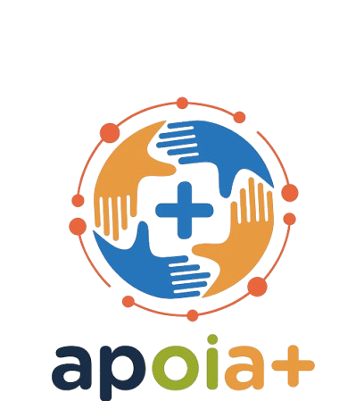

<p align="center">
  
</p>

<h1 align="center">📱 Apoia+ — Plataforma de Apoio</h1>

<p align="center">
  
  
  
</p>

---

## 📑 Sumário
- [🎯 Objetivo do Projeto](#-objetivo-do-projeto)
- [👥 Participantes](#-participantes)
- [🛠 Tecnologias Utilizadas](#-tecnologias-utilizadas)
- [📚 Documentações](#-documentações)
- [▶️ Como Rodar o Projeto](#️-como-rodar-o-projeto)
- [📄 Licença](#-licença)

---

## 🎯 Objetivo do Projeto

O **Apoia+** consiste no desenvolvimento de uma aplicação móvel voltada a conectar pessoas interessadas em doar a instituições sociais e ONGs cadastradas, promovendo o engajamento solidário e facilitando o acesso a campanhas de apoio em diversas regiões.

A plataforma tem como propósito:

- Centralizar informações sobre campanhas ativas  
- Simplificar o processo de doação  
- Ampliar a visibilidade de organizações sociais  
- Contribuir para os Objetivos de Desenvolvimento Sustentável (ODS), especialmente os ligados à redução das desigualdades e à erradicação da pobreza

---

## 👥 Participantes

| Matrícula | Nome |
|----------|------|
| 232024527 | Artur |
| 232025730 | Edson |
| 241012211 | Ester |
| 241011822 | Guilherme C |
| — | Guilherme |
| 231026456 | Lucas |
| 231012002 | Luis Fernando |
| 241011448 | Maria Luana |
| 190129344 | Paulo Vinicius |
| 241011878 | Thauany |
| 241012392 | Vinicius |

---

## 🛠 Tecnologias Utilizadas

- **Django** — desenvolvimento backedn e lógica de negócio  
- **Flutter** — desenvolvimento mobile  
- **Dart** — linguagem principal  
- **Git/GitHub** — versionamento  
- **Figma** — prototipação e design  


---

## 📚 Documentações

- **Arquitetura**
- **Casos de Uso**
- **Backlog**
- **Diagrama de Classes**
- **Protótipo (Figma)**
- **Visão do Produto**


---

## ▶️ Como Rodar o Projeto

```bash
# Clonar o repositório
git clone [https://github.com/fga-eps-mds/2025.2-Gilgamesh.git]

# Acessar o diretório
cd 2025.2-Gilgamesh

# Instalar dependências
pip install -r requirements.txt

# Executar o app
flutter run
